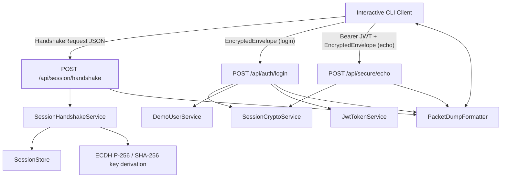
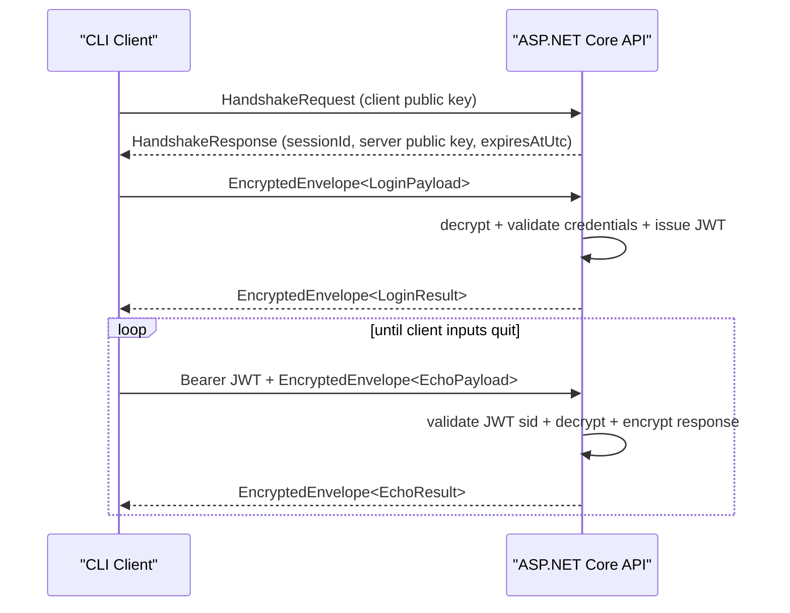

# Diffie-Hellman Key Exchange Demo

> ASP.NET Core Minimal API 서버와 interactive CLI 클라이언트로 ECDH 기반 키 교환, JWT 발급, 앱 레벨 AES-GCM 암호화를 단계별로 시연하는 데모 프로젝트

[](https://youtu.be/KefKMylYIek)
_Diffie-Hellman 알고리즘과 키 교환 프로세스를 확인할 수 있는 데모 영상_

보통 패킷 암호화 개념은 이론적으로는 익숙하지만, 하나의 프로토콜 흐름 안에서 어떻게 연결되는지는 눈으로 확인하기 어렵다. 특히 “어떤 값이 평문으로 존재하고, 어떤 시점부터 암호화되며, 서버는 무엇을 기준으로 세션을 신뢰하는가”는 콘솔 로그와 패킷 덤프를 함께 보지 않으면 감이 잘 잡히지 않는다.

이 프로젝트에서는 그 과정을 단계별로 확인할 수 있게 데모로 만들었다. 서버와 클라이언트는 둘 다 CLI에서 단계 로그를 출력하고, `handshake`, `login`, `echo` 단계마다 **평문 JSON**과 **암호화된 packet hex**를 함께 보여 준다. 이 방법으로 **언제 무엇이 암호화되고 무엇이 세션 경계 바깥에 남는지**를 눈으로 따라갈 수 있을 것이다.

## 별도의 암호화가 필요한 이유

TLS만으로도 전송 구간은 보호할 수 있지만, 실제 시스템 설계에서는 그 위에 별도의 앱 레벨 메시지 보호 계층을 둘 때가 있다. 예를 들면:

- 패킷을 변조를 하지 못하게 하고 싶을 때
- 사용자 정보나 각종 데이터를 패킷으로 분석하지 못하도록 막고 싶을 때
- 패킷을 분석해서 불법 복제 서버를 운영하지 못하게 하고 싶을 때

`ECDiffieHellman`으로 세션 비밀을 만들고 `AesGcm`으로 요청/응답을 감싸며, `JWT`는 별도의 인증 토큰으로 발급한다. 동시에 각 단계의 JSON과 hex packet dump를 CLI에 드러내어, **프로토콜이 실제로 어떤 데이터 흐름을 만드는지** 확인할 수 있다.

## 암호화 순서

실행하면 다음 흐름을 순서대로 확인할 수 있다.

1. 클라이언트가 계정과 비밀번호를 입력한다.
2. 클라이언트가 서버와 ECDH 핸드셰이크를 수행한다.
3. 서버는 세션별 ephemeral ECDH 키를 만들고, 세션 ID와 만료 시각을 돌려준다.
4. 클라이언트는 세션 키로 로그인 payload를 암호화해 전송한다.
5. 서버는 로그인 payload를 복호화하고 계정을 검증한 뒤 JWT를 발급한다.
6. 이후 클라이언트는 `echo` 메시지를 반복 입력하고, 서버는 JWT + 암호화 세션을 함께 검증한 뒤 응답한다.
7. 클라이언트가 정확히 `quit`를 입력하면 루프를 끝내고 종료한다.

이 과정에서 양쪽 CLI는 다음을 모두 출력한다.

- 단계별 진행 로그
- handshake request/response JSON
- login request/response 평문 JSON
- echo request/response 평문 JSON
- login/echo 요청과 응답의 encrypted packet hex
- 세션 ID, sequence, 방향 정보, 만료 시각

## 구현 내용

- 서버는 `ASP.NET Core Minimal API`로 구성돼 있다.
- 클라이언트는 `interactive console app`으로 동작한다.
- 공통 계층에는 DTO, ECDH/AES-GCM 유틸리티, packet dump formatter가 있다.
- 서버는 메모리 세션 저장소와 인메모리 데모 사용자 저장소를 사용한다.
- 테스트 프로젝트는 packet formatter와 실제 프로토콜 round-trip을 검증한다.

핵심 역할은 다음과 같이 나뉜다.

- `ApiHost`: 서버 호스트 구성, 인증, 엔드포인트 매핑, 단계 로그 출력
- `SessionStore`: 세션 ID, TTL, 방향별 sequence를 유지하는 메모리 저장소
- `SessionHandshakeService`: ECDH 핸드셰이크와 세션 생성
- `SessionCryptoService`: envelope 검증, 복호화, 응답 암호화
- `JwtTokenService`: 세션에 종속된 JWT 발급
- `DemoClientRunner`: interactive 입력, handshake/login/echo 실행, packet dump 출력
- `PacketDumpFormatter`: 평문 JSON pretty print, `nonce || ciphertext || tag` hex 블록 생성

## 시스템 구성 개요

서버와 클라이언트는 하나의 공통 계약/암호 계층을 공유하지만, 역할은 분리되어 있다.

- 클라이언트는 계정/비밀번호와 메시지를 입력받고, 요청을 암호화해서 전송한다.
- 서버는 세션을 만들고, 복호화 후 자격 증명을 검증하고, 인증된 응답을 다시 암호화해 돌려준다.
- 공통 계층은 DTO 직렬화, ECDH 키 파생, AES-GCM 암복호화, packet dump 형식을 제공한다.



아래 sequence는 실제 프로토콜 흐름을 요약한 것이다.



## 서버 런타임 상세


### 1. 세션 생성과 핸드셰이크

서버는 `POST /api/session/handshake`에서 클라이언트 공개키를 받고, 매 요청마다 새로운 `ECDiffieHellman` 키 쌍을 만든다.  
그 공개키로 공유 비밀을 계산한 뒤, 세션 저장소에 다음 정보를 등록한다.

- 세션 ID
- 절대 만료 시각
- 방향별 AES 키
- 방향별 nonce prefix
- client/server sequence 상태

세션은 메모리에서만 유지되며, 서버 재시작 시 모두 사라진다.

### 2. 암호화 로그인

로그인 단계는 익명 엔드포인트지만 본문은 평문이 아니라 `EncryptedEnvelope<LoginPayload>`다.  
서버는 먼저 envelope를 검증하고, 세션 저장소에서 해당 세션을 찾고, 요청 방향 키로 payload를 복호화한다. 그 다음 인메모리 임시 계정(`alice`, `bob`)과 비교해 자격 증명을 검증한다.

성공하면 서버는 JWT를 발급해 `LoginResult`로 만들고, 다시 세션의 응답 방향 키로 암호화해서 돌려준다.

### 3. 보호된 echo

`POST /api/secure/echo`는 두 가지를 동시에 요구한다.

- `Authorization: Bearer <jwt>`
- `EncryptedEnvelope<EchoPayload>`

즉, 인증과 기밀성을 따로 본다.  
서버는 먼저 JWT를 검증하고, 토큰 안의 `sid` 클레임이 envelope의 `sessionId`와 같은지도 확인한다. 그 다음 세션 키로 payload를 복호화하고, 응답을 다시 암호화해서 전송한다.

### 4. sequence와 replay 방지

각 세션은 요청 방향과 응답 방향 sequence를 따로 유지한다.

- 요청 sequence는 `1`부터 시작한다.
- 같은 값 재사용은 `409 Conflict`
- 순서가 건너뛰면 `409 Conflict`
- 잘못된 태그나 복호화 실패는 `400 Bad Request`
- 없는 세션 또는 만료 세션은 `410 Gone`
- JWT 없음은 `401 Unauthorized`
- JWT `sid`와 세션 불일치는 `403 Forbidden`

이 규칙 덕분에 “암호화는 되어 있지만 같은 패킷을 반복 재생하는” 상황을 감지할 수 있다.

### 5. 로그 출력과 테스트 환경

서버는 CLI에서 부팅 단계와 protocol step을 출력하지만, `Testing` 환경에서는 이 출력을 숨긴다.  
그래서 테스트는 출력 잡음 없이 동작하고, 실제 데모 실행에서는 진행 상태와 packet dump를 그대로 볼 수 있다.

## 클라이언트 런타임 상세

클라이언트는 브라우저 UI가 아니라, 프로토콜을 손으로 따라갈 수 있는 interactive 콘솔 앱이다.

실행 흐름은 다음과 같다.

1. 서버 주소를 내부 상수 `http://localhost:8080`으로 결정한다.
2. 계정과 비밀번호를 콘솔에서 입력받는다.
3. handshake request/response를 출력한다.
4. Enter를 눌러 login 단계로 진행한다.
5. login request/response와 packet dump를 출력한다.
6. Enter를 눌러 echo 단계로 진행한다.
7. 메시지를 반복 입력한다.
8. 각 메시지마다 echo request/response JSON과 encrypted packet hex를 출력한다.
9. 정확히 `quit`를 입력하면 서버로 전송하지 않고 종료한다.

현재 구현에서 빈 문자열도 정상 메시지로 전송된다.  
즉, `message` 입력은 “비어 있으면 오류”가 아니라 “빈 payload도 유효한 echo 요청”으로 처리된다.

## 메시지와 데이터 모델

### 엔드포인트

| 엔드포인트 | 의미 |
| --- | --- |
| `POST /api/session/handshake` | 클라이언트 공개키를 받아 세션 ID와 서버 공개키를 반환한다. |
| `POST /api/auth/login` | 암호화된 로그인 payload를 복호화하고 JWT를 발급한다. |
| `POST /api/secure/echo` | JWT와 세션 envelope를 함께 검증하고 echo 응답을 돌려준다. |

### 주요 DTO

| 타입 | 주요 필드 | 의미 |
| --- | --- | --- |
| `HandshakeRequest` | `clientPublicKeyBase64` | 클라이언트 공개키 |
| `HandshakeResponse` | `sessionId`, `serverPublicKeyBase64`, `expiresAtUtc`, `algorithm` | 세션 생성 결과 |
| `EncryptedEnvelope` | `sessionId`, `sequence`, `ciphertextBase64`, `tagBase64` | 암호화된 앱 레벨 패킷 |
| `LoginPayload` | `username`, `password` | 로그인 요청 평문 |
| `LoginResult` | `accessToken`, `expiresAtUtc`, `userName` | 로그인 응답 평문 |
| `EchoPayload` | `message` | echo 요청 평문 |
| `EchoResult` | `echoedMessage`, `userName`, `serverTimeUtc` | echo 응답 평문 |

### 시간 필드

시간 필드는 `Unix timestamp milliseconds`다.

- `HandshakeResponse.expiresAtUtc`
- `LoginResult.expiresAtUtc`
- `EchoResult.serverTimeUtc`

CLI 로그에서는 읽기 쉽게 다시 UTC ISO 형식으로 변환해 함께 보여 준다.

## 암호화와 패킷 덤프

암호화 전 평문과 암호화된 패킷을 hex로 모두 보여 준다.

### 평문 JSON

서버와 클라이언트는 암호화 전 payload를 pretty JSON으로 출력한다.

- handshake: request/response JSON
- login: request/response 평문 JSON
- echo: request/response 평문 JSON

현재 구현은 데모이기 때문에, login 단계의 계정/비밀번호와 발급된 JWT도 평문 JSON에 그대로 출력한다.

### encrypted packet hex

login과 echo 단계에서는 실제 암호화된 패킷을 hex로 출력한다.  
hex 블록의 canonical form은 다음과 같다.

```text
nonce || ciphertext || tag
```

여기서:

- `nonce`는 방향별 nonce prefix + sequence로 생성된다.
- `ciphertext`와 `tag`는 `AesGcm` 결과다.
- `sessionId`, `sequence`, direction은 hex 블록 바깥의 detail line에 따로 표시된다.

handshake는 암호화 단계가 없으므로 JSON만 출력하고 hex는 생략한다.

## 실행 방법

### 요구 사항

- .NET SDK 10

### 서버 실행

```bash
dotnet run --project /Users/catfoot/Sources/dotnet/DiffieHellmanKeyExchange/DiffieHellmanDemo.Api
```

설정 값을 수정하지 않았다면 일반적으로 `http://localhost:8080`에서 서버가 올라온다.

### 클라이언트 실행

```bash
dotnet run --project /Users/catfoot/Sources/dotnet/DiffieHellmanKeyExchange/DiffieHellmanDemo.Client
```

클라이언트는 옵션 없이 실행한다.  
실행하면 계정과 비밀번호를 입력받고, 이후 단계별 Enter 진행과 반복 echo 입력을 사용한다.

### 포트 관련 주의사항

현재 클라이언트는 `http://localhost:8080`에 고정되어 있다.  
따라서 `8080` 포트가 이미 다른 프로세스에 의해 사용 중이면:

- 기존 프로세스를 종료하거나
- 서버와 클라이언트의 기본 주소를 함께 수정해야 한다.

서버 포트만 따로 바꾸고 클라이언트 주소를 그대로 두면 연결되지 않는다.

## 현재 구조의 한계

이 프로젝트는 시연을 위한 데모이며, production-ready 보안 서버를 목표로 하지는 않는다.

- 세션과 사용자 저장소가 전부 메모리 기반이다.
- 로그인 비밀번호와 JWT를 packet dump 평문 JSON에 그대로 출력한다.
- JWT 서명 키도 프로세스 시작 시 새로 만들기 때문에 서버 재시작 후 재사용되지 않는다.
- 장기 서버 키, refresh token, 사용자 DB, 외부 인증 시스템은 없다.
- 클라이언트 서버 주소가 코드에 고정되어 있다.
- HTTPS redirection 설정 때문에 개발 환경에서 HTTP만 띄우면 경고가 섞일 수 있다.

## 마무리

이 프로젝트는 `ECDiffieHellman`, `AesGcm`, `JWT`, `sequence`, `sessionId`, packet dump를 각각 따로 설명하는 대신, 하나의 실행 흐름 안에서 연결해서 보여 주기 위해 만들었다. 서버와 클라이언트 양쪽에서 평문 JSON과 암호화된 packet hex를 모두 확인할 수 있기 때문에, 단순히 결과만 보는 것이 아니라 “프로토콜이 실제로 어떤 데이터를 주고받는지”를 단계별로 확인할 수 있다.
